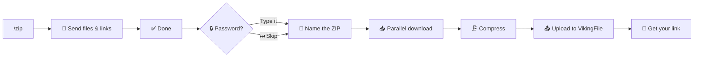

<div align="center">

# ⚡ NXT Viking Bot

### The fastest way to upload files & links to VikingFile, right from Telegram

[](https://www.python.org/)
[](https://docs.aiogram.dev/)
[](https://www.mongodb.com/)
[](https://www.docker.com/)
[](#)

**Powered by [@NXT_HUB](https://t.me/NXT_HUB)** · No size limits · Live progress · Built for speed

</div>

<br>

---

## ✨ Features

<table>
<tr>
<td width="50%" valign="top">

### 📤 Uploading
- Send any file → instant upload with a **live progress bar**
- Paste a URL → VikingFile fetches it remotely, **no size limit**
- Real byte-accurate speed & ETA on every transfer

### 🗜️ ZIP Builder
- Mix files **and** links into one ZIP
- Optional password protection
- Custom or auto-generated filename
- Parallel downloads, live compress progress

### 📁 My Files
- Browse folders & paginate through your library
- **🔗 Extract All Links** — dump every file URL in a folder
- Smart "Known Folders" shortcuts (see below)

</td>
<td width="50%" valign="top">

### 📊 Live Progress
- Cycling animated emoji on every card
- Moon-phase speed spinner 🌑🌒🌓🌕
- Filename, size, %, speed, ETA — always uniform

### 🔐 Account Integration
- Link your VikingFile **User Hash**
- Or upload anonymously — your choice
- Settings: default path, ZIP compression level

### 🛠️ Admin Tooling
- 📣 Silent log channel for every upload
- 📢 Hidden `/broadcast` & `/stats` — invisible to users
- 🔒 Required @NXT_HUB subscription gate

</td>
</tr>
</table>

---

## 🚀 Quick Start

<table>
<tr><td width="32px" align="center">1️⃣</td><td>

**Get a bot token** — message [@BotFather](https://t.me/BotFather), run `/newbot`, copy the token

</td></tr>
<tr><td align="center">2️⃣</td><td>

**Configure your environment**

```bash
cp .env.example .env
```

</td></tr>
<tr><td align="center">3️⃣</td><td>

**Run it**

```bash
# Docker (recommended)
docker compose up -d

# or locally
pip install -r requirements.txt
BOT_TOKEN=your_token python bot.py
```

</td></tr>
</table>

### Environment Variables

| Variable | Required | Description |
|:--|:--:|:--|
| `BOT_TOKEN` | ✅ | Your bot token from [@BotFather](https://t.me/BotFather) |
| `PYROGRAM_API_ID` / `PYROGRAM_API_HASH` | ✅ *(files >20MB)* | From [my.telegram.org](https://my.telegram.org) |
| `MONGO_URI` | ✅ | MongoDB connection string |
| `MONGO_DB` | optional | Database name — default `nxtup` |
| `LOG_CHANNEL_ID` | optional | Channel ID where uploads are silently logged |
| `ADMIN_IDS` | optional | Comma-separated user IDs for `/broadcast` & `/stats` |

---

## 📋 Commands

<table>
<tr>
<td width="50%" valign="top">

**Public**

| Command | Description |
|:--|:--|
| `/start` | 🏠 Main menu |
| `/help` | 📖 Full help guide |
| `/zip` | 🗜️ Start a ZIP session |
| `/done` | ✅ Finish & build the ZIP |
| `/myfiles` | 📁 Browse your uploads |
| `/settings` | ⚙️ Hash, path, compression |
| `/cancel` | ❌ Cancel current task |

</td>
<td width="50%" valign="top">

**Hidden (admin only)**

> Not registered with BotFather — never appears in the command menu, and silently does nothing for non-admins.

| Command | Description |
|:--|:--|
| `/broadcast <msg>` | Text → every known user |
| `/broadcast` *(reply)* | Forward that message → everyone |
| `/stats` | Show total registered users |

Set `ADMIN_IDS=id1,id2` to grant access.

</td>
</tr>
</table>

---

## 🗜️ ZIP Builder Flow



---

## 🔑 Linking Your VikingFile Account

<table>
<tr><td width="32px" align="center">1️⃣</td><td>Go to <a href="https://vikingfile.com">vikingfile.com</a> → Login → Settings</td></tr>
<tr><td align="center">2️⃣</td><td>Copy your <b>User Hash</b></td></tr>
<tr><td align="center">3️⃣</td><td>In the bot: <b>⚙️ Settings → 🔑 User Hash</b> → paste it</td></tr>
</table>

> Without a hash, files still upload fine — just anonymously, not linked to any account.

---

## 📁 Folder Navigation — a Known API Limitation

> VikingFile's API has **no endpoint to list folder names** — `list-files` only returns files for a `path` you already know. There's no way to discover "what folders exist" from the API alone.

**Our workaround:** the bot remembers every folder you've uploaded to or visited (stored per-user, up to 20 most recent) and surfaces them as one-tap **📁 My Known Folders** shortcuts in `/myfiles`. You can always type any path manually via **📂 Go to folder** too.

---

## 📣 Log Channel

Every successful upload — file, link, or ZIP — is silently posted to `LOG_CHANNEL_ID`:

```
📤 Upload · 👤 Account
┌─────────────────────────
│ 👤 @username  (123456789)
│ 📄 movie.mkv
│ 📦 657.2 MB
│ 🔗 Download link
└─────────────────────────
@NXT_HUB
```

<table>
<tr><td width="32px" align="center">1️⃣</td><td>Create a private Telegram channel</td></tr>
<tr><td align="center">2️⃣</td><td>Add your bot as admin with <i>"Post Messages"</i> permission</td></tr>
<tr><td align="center">3️⃣</td><td>Get the channel ID via <a href="https://t.me/userinfobot">@userinfobot</a></td></tr>
<tr><td align="center">4️⃣</td><td>Set <code>LOG_CHANNEL_ID=-100xxxxxxxxxx</code></td></tr>
</table>

> If unset, logging silently no-ops — nothing breaks.

---

## 🐳 Docker

<table>
<tr>
<td width="50%" valign="top">

**Dockerfile**
- Python 3.11 slim base
- GCC + zlib for `pyminizip`
- Non-root user
- Layered for fast rebuilds

</td>
<td width="50%" valign="top">

**docker-compose.yml**
- Auto-restart on failure
- Persistent `./temp` volume

</td>
</tr>
</table>

---

## 📂 Project Structure

```
NXTup/
├── bot.py                    # Entry point, dispatcher, Pyrogram lifecycle
├── config.py                 # Env vars, branding, admin/log config
├── requirements.txt
├── Dockerfile
├── docker-compose.yml
├── .env.example
│
├── handlers/
│   ├── start.py               # /start, /help, main menu
│   ├── upload.py               # File & link upload
│   ├── zip_handler.py           # Full ZIP build flow
│   ├── settings.py               # /settings
│   ├── my_files.py                 # /myfiles, folders, link extraction
│   └── broadcast.py                 # Hidden admin /broadcast, /stats
│
├── keyboards/
│   └── buttons.py              # All inline keyboards
│
├── middlewares/
│   └── subscription.py         # @NXT_HUB join gate
│
└── utils/
    ├── db.py                    # MongoDB (Motor) user storage
    ├── viking_api.py              # VikingFile API wrapper
    ├── downloader.py               # Multi-threaded HTTP downloader
    ├── tg_downloader.py             # Bot API + Pyrogram file downloader
    ├── logger.py                     # Log channel sender
    └── formatting.py                  # Progress cards, live emoji, helpers
```

---

## ⚙️ Per-User Settings

| Setting | Default | Description |
|:--|:--:|:--|
| 🔑 User Hash | *(none)* | VikingFile account link |
| 📂 Default Path | Root | Upload folder on VikingFile |
| 🗜️ ZIP Compression | `6` | `0` = fastest · `9` = smallest |

---

<div align="center">

### 🔗 Links

[**@NXT_HUB**](https://t.me/NXT_HUB) · [VikingFile](https://vikingfile.com) · [aiogram docs](https://docs.aiogram.dev/)

<sub>Made for speed. Built on aiogram 3 + Motor + Pyrogram.</sub>

</div>
